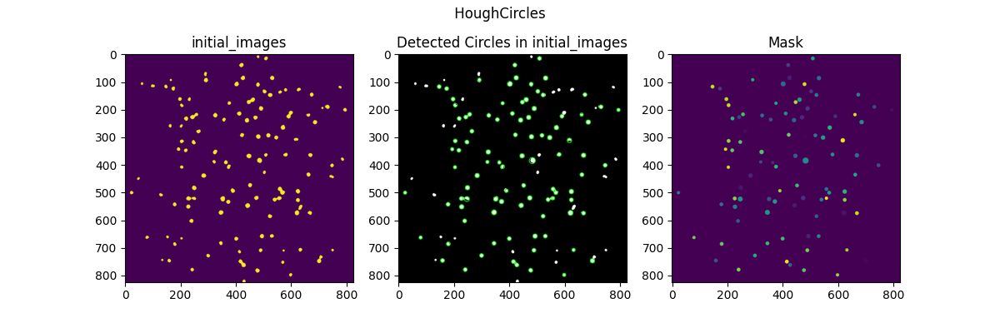

# Abstract
A pipeline for the segmentation of RBCs and abstracted their THG intensities from imaging. The THG imaging was firstly binarized by OTSU threshold which maximizes the inter-class variance between noised background and RBCs. Then, the digitized binary image was segmented into various contours and further filtered by a series of metrics including areas and roundness. According to the physical size of RBCs, setting the minimum and maximum area.  The minimum roundness was set as 0.6 so that removed objects that were constituted by overlapped or necrotic RBCs. Finally, the mean THG intensities and locations in the picture of RBCs were obtained, which can be compared with other excitation wavelengths imaging.



# Run
```bash
python src/run_rbc_detect.py --read_dir XXX --save_dir XXX --log_dir XXX
```

# Environment
```bash 
conda env create -f environment.yml
```
# Publication

